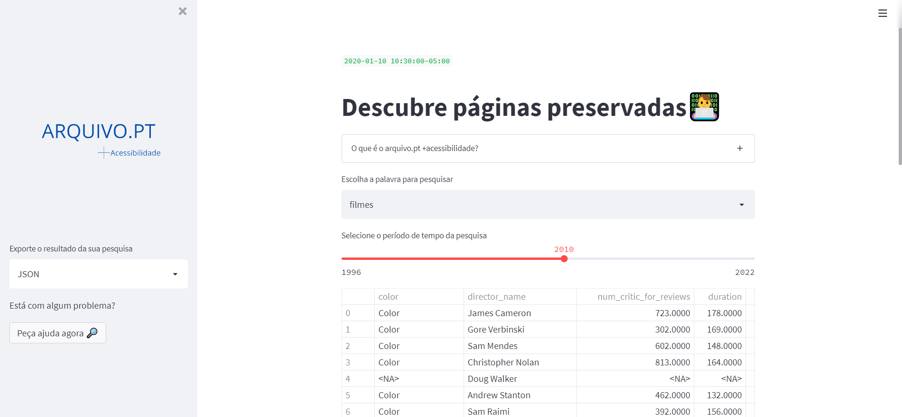

# +Acessibilidade - Democratização do acesso a informação em jornais portugueses: Acessbilidade para todos.

A presente solução consiste no primeiro sistema com configurações e layout feitos para pessoas com algum tipo de deficiência,  como físico, visual e cognitivo. O sistema foi criado para receber algoritmos de  coleta de dados de alta latência (Web 3.0), onde nosso objetivo é armazenar os dados jornalísticos português em um só lugar, no qual os usuários com descapacidade  possam acessar essas informações de forma fácil, compreensível  e amigáve. Nossa plataforma torna pesquisas e coletas de dados sobre qualquer tema algo simples e eficiente, assim, podemos fornecer uma ferramenta poderosa para pessoas que, 
por alguma dificuldade, não pode navegar na internet de forma fácil. Nossa plataforma usa tecnologias derivadas de python, react, java e streamlit predominantemente.

